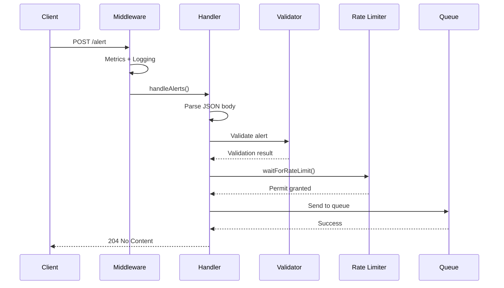

# API Server

The API Server is a REST API built with the Gin framework that accepts alerts and enqueues them for processing.

## Endpoints

| Method | Path | Description |
|--------|------|-------------|
| `POST` | `/alert` | Submit alerts (single or array) |
| `POST` | `/alert/:channelId` | Submit alerts to specific channel |
| `POST` | `/prometheus-alert` | Prometheus AlertManager webhook |
| `POST` | `/prometheus-alert/:channelId` | Prometheus webhook to specific channel |
| `GET` | `/mappings` | List routing rules |
| `GET` | `/channels` | List managed channels |
| `GET` | `/ping` | Health check |

## Request Flow



## Initialization

```go
server := api.New(
    alertQueue,    // FifoQueueProducer
    cacheStore,    // Cache for channel info
    logger,        // common.Logger
    metrics,       // common.Metrics
    cfg,           // *config.APIConfig
    settings,      // *config.APISettings
)

// Optional: Add raw alert consumer
server.WithRawAlertConsumer(rawAlertQueue)

// Start server (blocking)
err := server.Run(ctx)
```

## Middleware Stack

The server uses Gin middleware for cross-cutting concerns:

```go
router.Use(gin.Recovery())           // Panic recovery
router.Use(server.metricsMiddleware()) // Request metrics
router.Use(server.loggingMiddleware()) // Request logging
```

### Metrics Middleware

Records HTTP request metrics:

- Request path
- HTTP method
- Response status code
- Request duration

### Logging Middleware

Logs each request with:

- Method and path
- Response status
- Latency
- Client IP

## Rate Limiting

Per-channel token bucket rate limiting prevents alert floods:

```go
// Configuration
cfg.RateLimit.AlertsPerSecond = 1.0  // Refill rate
cfg.RateLimit.AllowedBurst = 10      // Bucket size
cfg.RateLimit.MaxAttempts = 3        // Retry attempts
```

### Rate Limit Behavior

1. **Under limit**: Alert processed immediately
2. **At limit**: Wait for tokens (up to `MaxWaitPerAttemptSeconds`)
3. **Exceeded**: Return `429 Too Many Requests`

### Burst Reduction

When too many alerts arrive:

1. Keep first N alerts (up to burst limit)
2. Create overflow summary alert
3. Log dropped alerts

## Channel Info Syncer

Background service that maintains channel metadata:

- Channel existence
- Archive status
- Bot membership
- User count

This prevents sending alerts to:

- Non-existent channels
- Archived channels
- Channels where the bot isn't a member
- Channels exceeding user count limits

## Error Handling

### Client Errors (4xx)

- `400 Bad Request`: Invalid JSON, validation failure
- `429 Too Many Requests`: Rate limit exceeded

### Server Errors (5xx)

- `500 Internal Server Error`: Queue failure, encryption error

### Error Reporting

When `ErrorReportChannelID` is configured, client errors generate alerts:

```go
cfg.ErrorReportChannelID = "C0ERROR123"
```

Error alerts include:

- HTTP status code
- Error message
- Target channel
- Debug information (truncated)

## Code Structure

```
api/
├── server.go                    # Server initialization, middleware
├── handle_alert.go              # Alert endpoint handlers
├── handle_prometheus_webhook.go # Prometheus webhook handler
├── handle_channels.go           # Channel listing
├── handle_mappings.go           # Routing rules listing
├── handle_ping.go               # Health check
└── channel_info_syncer.go       # Channel metadata sync
```
