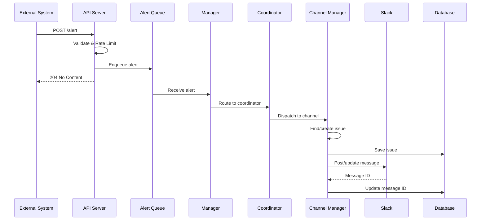
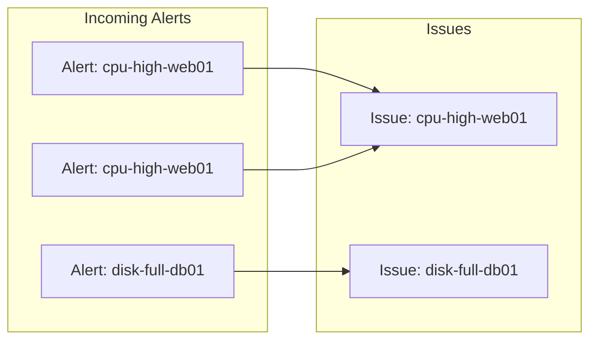
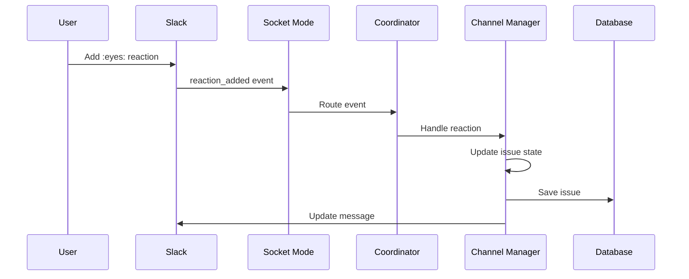
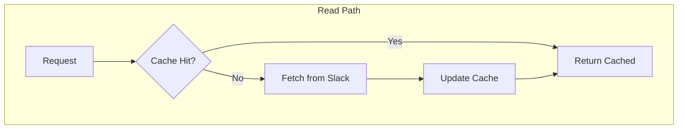
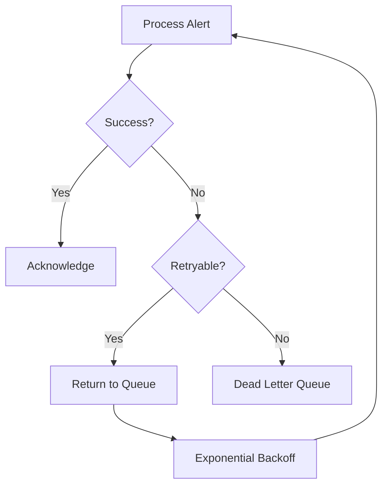

# Data Flow

This document describes how data flows through the Slack Manager system.

## Alert Processing Flow



## Alert Correlation

Alerts are grouped into issues using correlation IDs:



### Correlation Logic

1. Extract `correlationId` from alert
2. Search for existing issue with matching ID
3. If found: Add alert to existing issue
4. If not found: Create new issue

## Issue State Transitions

```mermaid
stateDiagram-v2
    [*] --> Firing: New alert
    Firing --> Acknowledged: :eyes: reaction
    Acknowledged --> Firing: Remove :eyes:
    Firing --> Resolved: :white_check_mark: reaction
    Acknowledged --> Resolved: :white_check_mark:
    Resolved --> Firing: New alert (same correlation)
    Resolved --> Archived: Archive delay elapsed
    Archived --> [*]
```

### State Descriptions

| State | Description | Slack Indicator |
|-------|-------------|-----------------|
| Firing | Active issue, needs attention | Red status |
| Acknowledged | Someone is looking at it | :eyes: reaction |
| Resolved | Issue is fixed | :white_check_mark: reaction |
| Archived | Issue cleaned up | Message deleted/archived |

## Slack Event Flow



## Message Queue Patterns

### Alert Queue

- **Type**: FIFO (First-In-First-Out)
- **Deduplication**: By correlation ID + channel
- **Visibility Timeout**: Extended during processing
- **Dead Letter Queue**: For failed messages

### Command Queue

- **Type**: FIFO
- **Purpose**: Inter-component commands
- **Examples**: Force refresh, bulk operations

## Data Structures

### Alert

```json
{
  "correlationId": "cpu-high-web01",
  "header": ":rotating_light: High CPU",
  "text": "Server web-01 CPU at 95%",
  "severity": "error",
  "slackChannelId": "C0123456789",
  "routeKey": "production",
  "createdAt": "2024-01-15T10:30:00Z"
}
```

### Issue

```json
{
  "id": "issue-123",
  "correlationId": "cpu-high-web01",
  "channelId": "C0123456789",
  "messageTs": "1705315800.123456",
  "state": "firing",
  "alerts": [...],
  "createdAt": "2024-01-15T10:30:00Z",
  "updatedAt": "2024-01-15T10:35:00Z"
}
```

## Caching Strategy



### Cached Data

| Data | TTL | Purpose |
|------|-----|---------|
| Channel Info | 5 min | Validate channel exists |
| User Info | 5 min | Display names in messages |
| Bot Info | 1 hour | Self-identification |

## Error Handling

### Retry Strategy



### Error Categories

| Category | Action | Example |
|----------|--------|---------|
| Transient | Retry | Network timeout |
| Rate Limit | Wait & Retry | Slack rate limit |
| Permanent | DLQ | Invalid channel |
