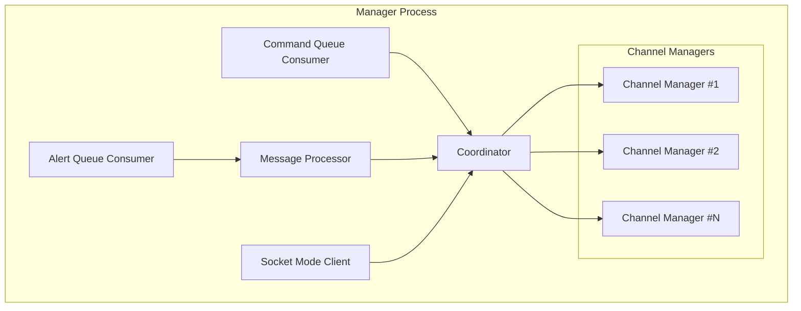
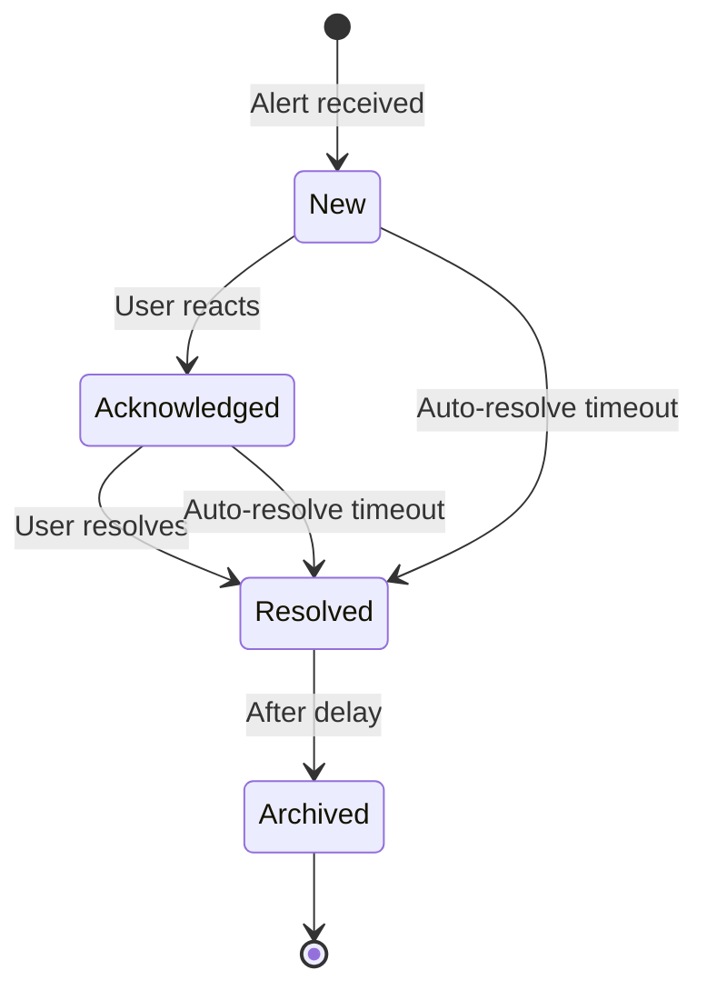
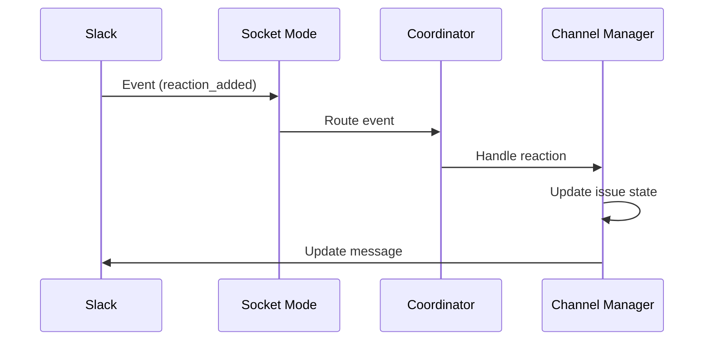

# Manager

The Manager is the core processing component that handles alerts, manages issues, and integrates with Slack.

## Responsibilities

- Consume alerts from the queue
- Group correlated alerts into issues
- Manage issue lifecycle states
- Send and update Slack messages
- Handle Slack interactions (reactions, buttons, modals)
- Persist issue state to database

## Initialization

```go
manager := manager.New(
    db,            // Database interface
    alertQueue,    // FifoQueueConsumer
    commandQueue,  // FifoQueueConsumer
    cacheStore,    // Cache store
    logger,        // common.Logger
    metrics,       // common.Metrics
    cfg,           // *config.ManagerConfig
    settings,      // *config.ManagerSettings
)

// Start manager (blocking)
err := manager.Run(ctx)
```

## Internal Architecture



## Goroutine Structure

The Manager runs multiple concurrent goroutines:

| Goroutine | Purpose |
|-----------|---------|
| Alert Queue Consumer | Receives alerts from SQS |
| Command Queue Consumer | Receives commands from SQS |
| Message Processor | Transforms queue items |
| Coordinator | Routes messages to channel managers |
| Socket Mode Client | Handles Slack real-time events |
| Channel Manager (per channel) | Manages issues for one channel |

All goroutines are managed via `errgroup.Group` for coordinated shutdown.

## Coordinator

The Coordinator is the central routing component:

```go
type Coordinator struct {
    channelManagers map[string]*ChannelManager
    // ...
}
```

### Responsibilities

- Route alerts to appropriate channel manager
- Create channel managers on demand
- Handle cross-channel operations
- Process Slack events from Socket Mode

## Channel Manager

One Channel Manager instance per active Slack channel:

```go
type ChannelManager struct {
    channelID  string
    issues     *IssueCollection
    slackAPI   *slackapi.Client
    // ...
}
```

### Issue Collection

Each channel maintains a collection of active issues:

- Issues indexed by correlation ID
- Automatic cleanup of resolved/archived issues
- Thread-safe operations with mutex protection

### Issue Lifecycle



## Socket Mode Integration

The Manager uses Slack Socket Mode for real-time events:

### Supported Events

| Event Type | Handler |
|------------|---------|
| `reaction_added` | Issue acknowledgment/resolution |
| `reaction_removed` | Undo acknowledgment |
| `message` | Thread replies |
| `block_actions` | Button clicks |
| `view_submission` | Modal submissions |

### Event Processing



## Database Integration

The Manager persists issues to a database (typically DynamoDB):

```go
type DB interface {
    GetIssue(ctx context.Context, id string) (*Issue, error)
    SaveIssue(ctx context.Context, issue *Issue) error
    DeleteIssue(ctx context.Context, id string) error
    ListIssues(ctx context.Context, channelID string) ([]*Issue, error)
}
```

### Persistence Strategy

- Issues saved on state changes
- Periodic sync for long-running issues
- Cleanup of archived issues after configurable delay

## Code Structure

```
manager/
├── manager.go              # Manager initialization
├── coordinator.go          # Message routing
├── channel_manager.go      # Per-channel issue management
└── internal/
    ├── models/
    │   ├── issue.go        # Issue data structure
    │   ├── alert.go        # Alert data structure
    │   └── command.go      # Command data structure
    └── slack/
        ├── socket_mode.go  # Socket Mode client
        ├── controllers/    # Event handlers
        └── views/          # Message templates
```
