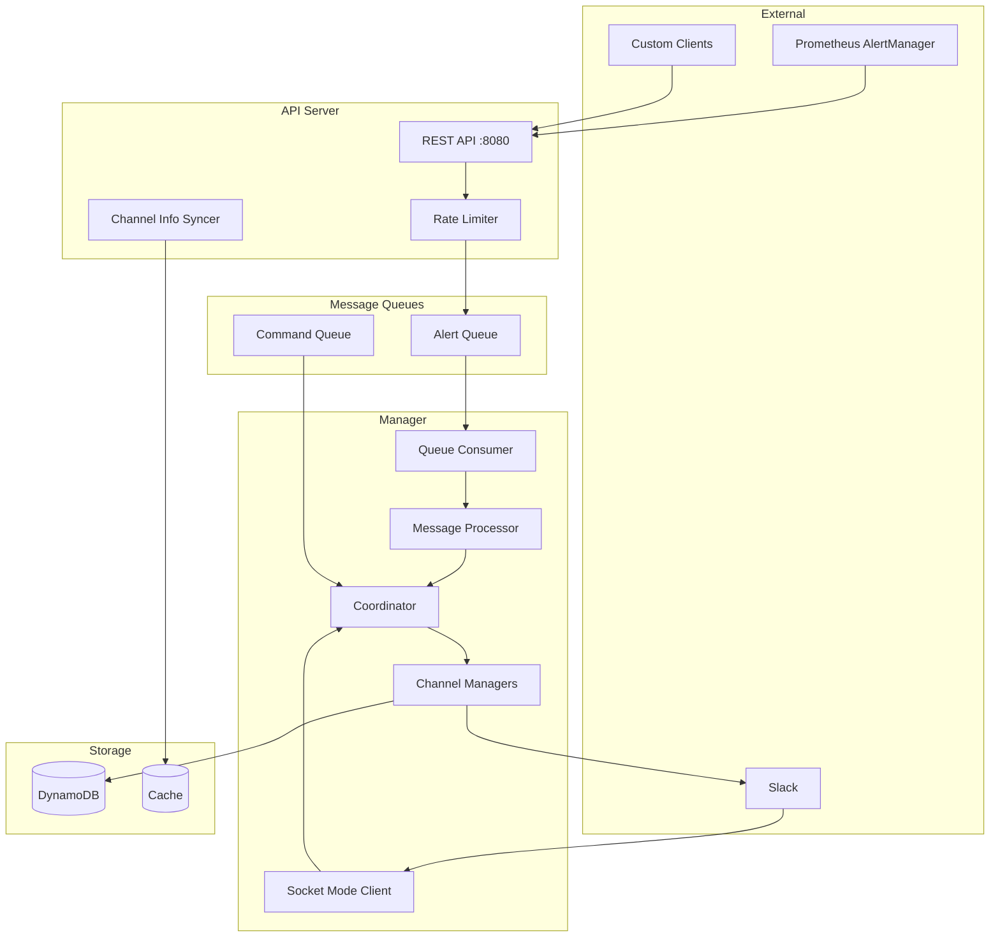

# Architecture Overview

Slack Manager is built as a distributed system with two main components that communicate via message queues.

## System Components



## Design Principles

### Library-First Design

Slack Manager is designed as an importable Go library, not a standalone binary:

```go
// API Server
server := api.New(alertQueue, cacheStore, logger, metrics, apiConfig, apiSettings)
server.Run(ctx)

// Manager
manager := manager.New(db, alertQueue, commandQueue, cacheStore, logger, metrics, managerConfig, managerSettings)
manager.Run(ctx)
```

This allows you to:

- Integrate with your existing infrastructure
- Use your preferred message queue implementation
- Customize logging, metrics, and error handling
- Deploy API and Manager separately or together

### Interface-Based Dependencies

All external dependencies are defined as interfaces:

```go
type FifoQueueProducer interface {
    Send(ctx context.Context, channelID, dedupID, body string) error
}

type FifoQueueConsumer interface {
    Receive(ctx context.Context, sink chan<- *FifoQueueItem) error
}

type DB interface {
    GetIssue(ctx context.Context, id string) (*Issue, error)
    SaveIssue(ctx context.Context, issue *Issue) error
    // ...
}
```

### Concurrency Model

Slack Manager uses Go's concurrency primitives extensively:

| Pattern | Usage |
|---------|-------|
| `errgroup` | Managing goroutine lifecycles |
| Channels | Inter-component message passing |
| Mutexes | Protecting shared state |
| Token Bucket | Per-channel rate limiting |

## Component Responsibilities

### API Server

- Accepts HTTP requests on port 8080
- Validates and transforms incoming alerts
- Applies per-channel rate limiting
- Enqueues alerts for asynchronous processing
- Syncs channel information from Slack

### Manager

- Consumes alerts from the queue
- Groups correlated alerts into issues
- Manages issue lifecycle (new → acknowledged → resolved)
- Handles Slack events (reactions, messages, interactions)
- Persists issue state to database

### Channel Manager

One instance per active Slack channel:

- Maintains issue collection for the channel
- Processes alerts and updates issues
- Sends/updates Slack messages
- Handles issue archival after resolution

## Scalability

### Horizontal Scaling

- **API Server**: Scale horizontally behind a load balancer
- **Manager**: Single instance per deployment (uses Slack Socket Mode)

### Throughput

Default rate limits:

| Metric | Default | Configurable |
|--------|---------|--------------|
| Alerts per second per channel | 1 | Yes |
| Burst size | 10 | Yes |
| Max concurrent channels | Unlimited | - |

## Fault Tolerance

### At-Least-Once Delivery

- Alerts are persisted to queue before acknowledgment
- Failed processing returns messages to queue
- Deduplication via correlation ID prevents duplicates

### Graceful Shutdown

- HTTP server drains connections on shutdown
- Queue consumers finish processing current message
- Socket Mode client disconnects cleanly
