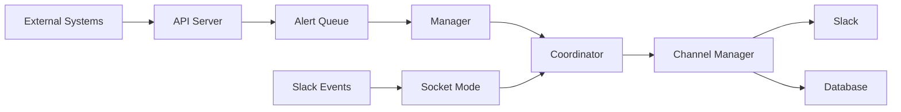

# Slack Manager

**Slack Manager** is a Go-based Slack bot/application that manages alerts and issues within Slack channels. It receives alerts from external monitoring systems (Prometheus, REST APIs), groups correlated alerts into "issues", and manages issue lifecycle through Slack reactions and interactions.

## Key Features

- **Alert Ingestion** - Receive alerts from Prometheus AlertManager, custom REST APIs, or any HTTP client
- **Alert Correlation** - Automatically group related alerts into issues using correlation IDs
- **Issue Lifecycle Management** - Track issue states (new, acknowledged, resolved) via Slack reactions
- **Per-Channel Rate Limiting** - Prevent alert floods with configurable rate limits
- **Slack Integration** - Real-time updates via Socket Mode, interactive modals and buttons
- **Flexible Routing** - Route alerts to channels based on route keys, prefixes, or regex patterns

## Architecture Overview

The system consists of two main services:

| Component | Description |
|-----------|-------------|
| **API Server** | REST API accepting alerts on port 8080 |
| **Manager** | Processes alerts, manages issues, handles Slack events |

## Quick Links

-   :material-rocket-launch:{ .lg .middle } **Getting Started**

    ---

    Get up and running with Slack Manager in minutes

    [:octicons-arrow-right-24: Quick Start](getting-started/quickstart.md)

-   :material-cog:{ .lg .middle } **Configuration**

    ---

    Configure API settings, routing rules, and rate limits

    [:octicons-arrow-right-24: Configuration Guide](getting-started/configuration.md)

-   :material-api:{ .lg .middle } **API Reference**

    ---

    Complete API documentation with examples

    [:octicons-arrow-right-24: API Reference](api/overview.md)

-   :material-code-braces:{ .lg .middle } **Development**

    ---

    Set up your development environment and contribute

    [:octicons-arrow-right-24: Development Guide](development/setup.md)

## Technology Stack

| Technology | Purpose |
|------------|---------|
| Go 1.21+ | Primary language |
| Gin | HTTP framework |
| Slack API | Bot integration |
| SQS/FIFO Queues | Message passing |
| DynamoDB | Issue persistence |

## License

Slack Manager is licensed under the [MIT License](https://github.com/peteraglen/slack-manager/blob/main/LICENSE).
