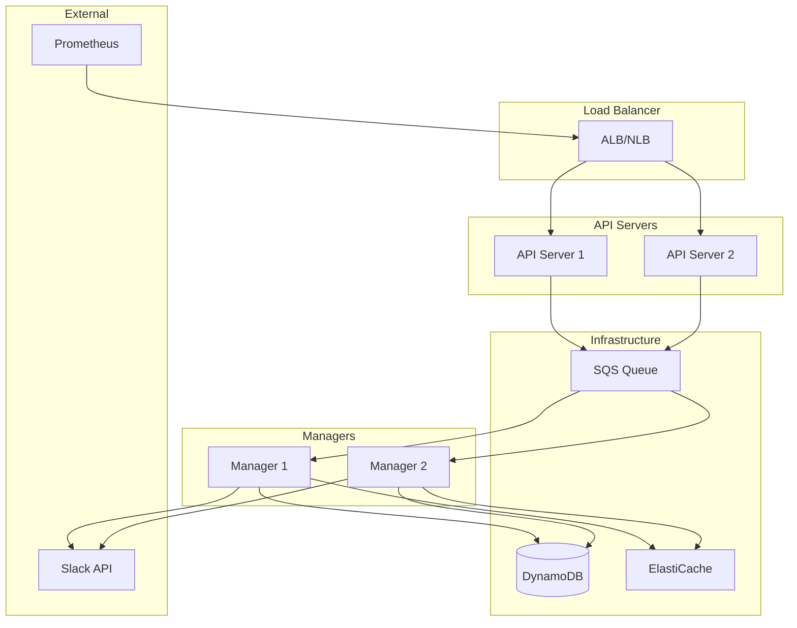

# Deployment Guide

Deploy Slack Manager to production environments.

## Deployment Architecture



## Docker Deployment

### Dockerfile

```dockerfile
FROM golang:1.21-alpine AS builder

WORKDIR /app
COPY go.mod go.sum ./
RUN go mod download

COPY . .
RUN CGO_ENABLED=0 GOOS=linux go build -o /slack-manager ./cmd/server

FROM alpine:3.19
RUN apk --no-cache add ca-certificates
COPY --from=builder /slack-manager /slack-manager

EXPOSE 8080
ENTRYPOINT ["/slack-manager"]
```

### Docker Compose

```yaml
version: '3.8'

services:
  api:
    build: .
    command: ["api"]
    ports:
      - "8080:8080"
    environment:
      - SLACK_BOT_TOKEN=${SLACK_BOT_TOKEN}
      - SLACK_APP_TOKEN=${SLACK_APP_TOKEN}
      - AWS_REGION=us-east-1
      - ALERT_QUEUE_URL=${ALERT_QUEUE_URL}
    depends_on:
      - localstack

  manager:
    build: .
    command: ["manager"]
    environment:
      - SLACK_BOT_TOKEN=${SLACK_BOT_TOKEN}
      - SLACK_APP_TOKEN=${SLACK_APP_TOKEN}
      - AWS_REGION=us-east-1
      - ALERT_QUEUE_URL=${ALERT_QUEUE_URL}
      - DYNAMODB_TABLE=${DYNAMODB_TABLE}
    depends_on:
      - localstack

  localstack:
    image: localstack/localstack
    ports:
      - "4566:4566"
    environment:
      - SERVICES=sqs,dynamodb
```

## Kubernetes Deployment

### API Server Deployment

```yaml
apiVersion: apps/v1
kind: Deployment
metadata:
  name: slack-manager-api
spec:
  replicas: 2
  selector:
    matchLabels:
      app: slack-manager-api
  template:
    metadata:
      labels:
        app: slack-manager-api
    spec:
      containers:
        - name: api
          image: slack-manager:latest
          args: ["api"]
          ports:
            - containerPort: 8080
          env:
            - name: SLACK_BOT_TOKEN
              valueFrom:
                secretKeyRef:
                  name: slack-secrets
                  key: bot-token
          resources:
            requests:
              memory: "128Mi"
              cpu: "100m"
            limits:
              memory: "256Mi"
              cpu: "200m"
          livenessProbe:
            httpGet:
              path: /ping
              port: 8080
            initialDelaySeconds: 10
            periodSeconds: 10
          readinessProbe:
            httpGet:
              path: /ping
              port: 8080
            initialDelaySeconds: 5
            periodSeconds: 5
```

### Manager Deployment

```yaml
apiVersion: apps/v1
kind: Deployment
metadata:
  name: slack-manager
spec:
  replicas: 2
  selector:
    matchLabels:
      app: slack-manager
  template:
    metadata:
      labels:
        app: slack-manager
    spec:
      containers:
        - name: manager
          image: slack-manager:latest
          args: ["manager"]
          env:
            - name: SLACK_BOT_TOKEN
              valueFrom:
                secretKeyRef:
                  name: slack-secrets
                  key: bot-token
            - name: SLACK_APP_TOKEN
              valueFrom:
                secretKeyRef:
                  name: slack-secrets
                  key: app-token
          resources:
            requests:
              memory: "256Mi"
              cpu: "200m"
            limits:
              memory: "512Mi"
              cpu: "500m"
```

### Service

```yaml
apiVersion: v1
kind: Service
metadata:
  name: slack-manager-api
spec:
  selector:
    app: slack-manager-api
  ports:
    - port: 80
      targetPort: 8080
  type: ClusterIP
```

### Ingress

```yaml
apiVersion: networking.k8s.io/v1
kind: Ingress
metadata:
  name: slack-manager
  annotations:
    kubernetes.io/ingress.class: nginx
spec:
  rules:
    - host: alerts.example.com
      http:
        paths:
          - path: /
            pathType: Prefix
            backend:
              service:
                name: slack-manager-api
                port:
                  number: 80
```

## AWS Infrastructure

### Terraform Example

```hcl
# SQS Queue
resource "aws_sqs_queue" "alert_queue" {
  name                       = "slack-manager-alerts.fifo"
  fifo_queue                 = true
  content_based_deduplication = true
  visibility_timeout_seconds = 300

  redrive_policy = jsonencode({
    deadLetterTargetArn = aws_sqs_queue.dlq.arn
    maxReceiveCount     = 3
  })
}

# DynamoDB Table
resource "aws_dynamodb_table" "issues" {
  name         = "slack-manager-issues"
  billing_mode = "PAY_PER_REQUEST"
  hash_key     = "channel_id"
  range_key    = "issue_id"

  attribute {
    name = "channel_id"
    type = "S"
  }

  attribute {
    name = "issue_id"
    type = "S"
  }

  ttl {
    attribute_name = "expires_at"
    enabled        = true
  }
}

# ECS Service
resource "aws_ecs_service" "api" {
  name            = "slack-manager-api"
  cluster         = aws_ecs_cluster.main.id
  task_definition = aws_ecs_task_definition.api.arn
  desired_count   = 2
  launch_type     = "FARGATE"

  network_configuration {
    subnets         = var.private_subnets
    security_groups = [aws_security_group.api.id]
  }

  load_balancer {
    target_group_arn = aws_lb_target_group.api.arn
    container_name   = "api"
    container_port   = 8080
  }
}
```

## Environment Variables

### Required

| Variable | Description |
|----------|-------------|
| `SLACK_BOT_TOKEN` | Bot OAuth token (`xoxb-...`) |
| `SLACK_APP_TOKEN` | App-level token (`xapp-...`) |
| `ALERT_QUEUE_URL` | SQS queue URL |

### Optional

| Variable | Default | Description |
|----------|---------|-------------|
| `PORT` | `8080` | API server port |
| `LOG_LEVEL` | `info` | Log level |
| `DYNAMODB_TABLE` | - | DynamoDB table name |
| `REDIS_URL` | - | Redis connection URL |

## Health Checks

### Liveness Probe

```bash
curl http://localhost:8080/ping
# Returns: pong
```

### Readiness Probe

```bash
curl http://localhost:8080/ping
# Returns: pong (when ready to accept traffic)
```

## Scaling Considerations

### API Server

- Stateless, scale horizontally
- Use load balancer for traffic distribution
- Recommended: 2+ replicas for HA

### Manager

- Maintains channel state
- Use leader election for single active instance per channel
- Recommended: 2 replicas with leader election

### Queue

- Use FIFO queue for ordered processing
- Enable content-based deduplication
- Set appropriate visibility timeout (5 minutes)

## Security

### Network

- Run in private subnets
- Use security groups to restrict access
- TLS termination at load balancer

### Secrets

- Store tokens in secrets manager
- Rotate tokens periodically
- Use IAM roles for AWS access

### API

- Enable rate limiting
- Validate all inputs
- Log security events
